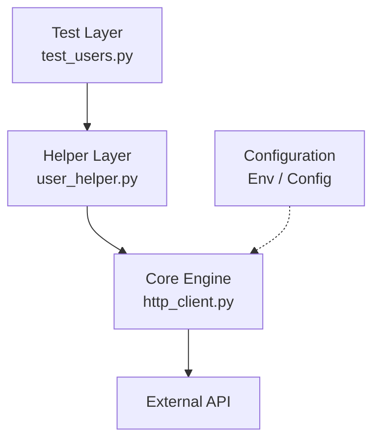

# How I Stopped Hardcoding and Designed a Decoupled API Automation Framework

Recently, I was working with a client who needed a complete overhaul of their API automation framework. When I opened their legacy repository, I found what many of us have seen before: a single test file stretching past 2,000 lines. Base URLs were hardcoded everywhere. `requests.post()` calls sat next to business assertions. Token generation logic was copy-pasted across dozens of tests.

Then a developer changed one endpoint path—from `/api/v1/auth` to `/api/v2/auth`—and the CI pipeline broke across the board.

Spending a week updating hardcoded strings in fifty test files is not test engineering. It is firefighting.

That experience pushed me to rethink how the team approached API automation from the ground up. What follows is the first version of that design: a clean, decoupled, four-layer Python and Pytest system built to survive application changes without constant rework.

---

## The Core Problem: Tight Coupling

Most QA automation setups fail at scale because of **tight coupling**.

When test scripts know too much about implementation details—exact endpoints, authorization headers, HTTP transport—they become fragile. A small configuration change in the application can cause widespread test failures that have nothing to do with broken business logic.

The goal was simpler: tests should focus on **verifying business logic**. Environment URLs, authentication, and HTTP mechanics should stay out of sight.

Here is the architectural blueprint I used to separate those concerns:



| Layer | Responsibility | What tests should *not* know |
| --- | --- | --- |
| **Test** | Business scenarios and assertions | Endpoint paths, HTTP verbs, auth headers |
| **Helper** | Domain-specific API operations | Base URLs, token handling, retry logic |
| **Core Engine** | HTTP transport, logging, error handling | Business rules |
| **Configuration** | Environment-specific values | Test logic |

Every layer in that table maps to a folder in the repository. Here is the layout the snippets in this post refer to:

```text
pytest-api-framework/
│
├── core/
│   └── http_client.py      # Transport & engine layer
│
├── helpers/
│   └── user_helper.py      # Business-centric component actions
│
├── tests/
│   ├── conftest.py         # Dynamic pytest fixture initialization
│   └── test_users.py       # High-level declarative test layer
│
└── README.md               # Your technical portfolio documentation
```

---

## Step 1: Build a Centralized HTTP Client

Instead of letting each test import `requests` directly, we routed every call through a single wrapper: `HttpClient`.

Think of it as the framework's engine room. One class gives you a single place to inject auth tokens, log payloads, and handle connection errors consistently across thousands of runs.

**`core/http_client.py`**

```python
import logging

import requests

logging.basicConfig(level=logging.INFO)
logger = logging.getLogger(__name__)


class HttpClient:
    def __init__(self, base_url, token=None):
        self.base_url = base_url
        self.headers = {
            "Content-Type": "application/json",
            "Accept": "application/json",
        }
        if token:
            self.headers["Authorization"] = f"Bearer {token}"

    def request(self, method, endpoint, **kwargs):
        url = f"{self.base_url}{endpoint}"
        headers = {**self.headers, **kwargs.pop("headers", {})}

        logger.info("Sending %s request to %s", method.upper(), url)

        try:
            response = requests.request(method, url, headers=headers, **kwargs)
            logger.info("Response status: %s", response.status_code)
            return response
        except Exception as err:
            logger.error("Transport failure: %s", err)
            raise
```

---

## Step 2: Hide Technical Details Behind Business Helpers

With the transport layer in place, the next problem was endpoint sprawl.

Tests should not care whether a user operation uses `POST` or `PATCH`, or what the path string looks like. They should call a function that reads like the business action it performs.

We introduced a **component helper pattern**: one helper class per domain area, wrapping endpoints behind clear method names.

**`helpers/user_helper.py`**

```python
from core.http_client import HttpClient


class UserHelper:
    def __init__(self, base_url, token=None):
        self.client = HttpClient(base_url, token)
        # Change the path once; every test picks it up automatically
        self.user_endpoint = "/api/users"

    def create_new_profile(self, name, occupation):
        payload = {"name": name, "job": occupation}
        return self.client.request("POST", self.user_endpoint, json=payload)

    def fetch_profile_by_id(self, user_id):
        return self.client.request("GET", f"{self.user_endpoint}/{user_id}")
```

When `/api/users` becomes `/api/v2/users`, you update one line—not fifty test files.

---

## Step 3: Streamline Setup with Pytest Fixtures

Even with helpers in place, repeating setup code in every test file adds friction. Pytest fixtures solve that cleanly.

By defining shared components in `conftest.py`, any test can request a ready-to-use helper without hardcoding URLs or manually wiring dependencies.

**`tests/conftest.py`**

```python
import pytest

from helpers.user_helper import UserHelper


@pytest.fixture(scope="session")
def base_url():
    # Single switch for environment targeting
    return "https://reqres.in"


@pytest.fixture(scope="function")
def user_component(base_url):
    return UserHelper(base_url)
```

Switching from staging to production becomes a one-line change in the fixture—not a repo-wide search and replace.

---

## Step 4: Write Tests That Read Like Specifications

With the architecture handling transport, auth, and setup, the tests themselves stay short and readable. No raw HTTP calls. No string concatenation. No boilerplate.

A product manager or a new engineer should be able to read a test and understand what behavior is being verified.

**`tests/test_users.py`**

```python
def test_should_successfully_register_new_user(user_component):
    """A user profile can be registered with valid inputs."""
    target_name = "Alex"
    target_job = "Lead SDET"

    response = user_component.create_new_profile(target_name, target_job)

    assert response.status_code == 201
    body = response.json()
    assert body["name"] == target_name
    assert body["job"] == target_job
    assert "id" in body


def test_should_retrieve_valid_user_by_id(user_component):
    """The system returns an existing user profile by ID."""
    existing_id = 2

    response = user_component.fetch_profile_by_id(existing_id)

    assert response.status_code == 200
    assert response.json()["data"]["id"] == existing_id
```

The Arrange–Act–Assert structure is still there, but the test reads as a specification—not a networking script.

---

## What Changed for the Team

Moving from ad hoc scripts to this four-layer structure changed how the client's team treated automation. Maintenance stopped being reactive. Tests survived endpoint and config changes because the coupling had been removed at the design level.

That said, this was the first iteration—not the final one.

As the application grew to hundreds of endpoints, complex relational payloads, and dynamic authorization scopes, this baseline hit new limits. The framework eventually evolved into a production-ready version with metaprogramming, schema contracts, and dynamic session management.

In the next post, I will walk through how we took this foundation and scaled it for enterprise use.

---

*To be continued.*
